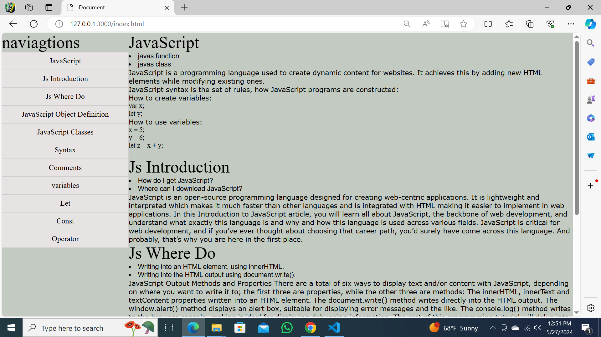

# Project Title 🚀
Documentation_page
## Project Description 📝

> this project is useful for who want to now some basic information about JS.
Examples:

- When I started learning html and CSS at the first I searched about those.
- It can give important and basic info about JS.
- whith this project I learned what is JS and how it is useful.
```
```
## Demo 📸



## Technologies Used 🛠️

- HTML
- CSS


## Installation 💻

Provide step-by-step instructions on how to install and set up your project. Include any dependencies or prerequisites that need to be installed.

```bash
#git clone git@github.com:latifa-wakili/Documentation-page.git
```

```bash
# cd Documentation-page
```
```bash
# vscode.
```

## Usage 🎯

```bash
# use git clone .
```

## Features ⭐

Examples:

- Feature 1- change background color when give it wihgt
- change background color when chose a nav


## Author 👩‍💻
- Twitter: [@Latifa_Wakili](https://x.com/WakiliLatifa?t=wlHTh8JuyFprQsN_hZQGWQ&s=08)
- LinkedIn: [Latifa Wakili](https://www.linkedin.com/in/latifa-wakili-68423b277?utm_source=share&utm_campaign=share_via&utm_content=profile&utm_medium=android_app)
- Email: [Latifa Wakili](saavenwakili@gmail.com)

## Contributing 🤝
for team working at first you should creat an organization on git hub nex you can creat pull_request on your project to shear whith your team and work on it together.

